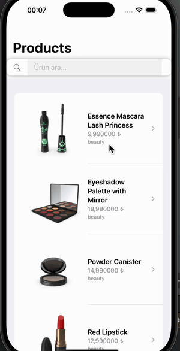

# Task2

Task2, ürünleri listeleyen ve detaylarını gösteren, kullanıcı dostu bir e-ticaret uygulaması için geliştirilmiş bir iOS uygulamasıdır. Uygulama, SwiftUI, Combine ve Core Data gibi teknolojiler kullanarak verileri yerel olarak depolar ve ağ üzerinden günceller.

## Özellikler

- **Ürün Listesi**: Kullanıcılar, ürünlerin adını, fiyatını ve kategorisini görüntüleyebilir.
- **Ürün Detayı**: Ürün tıklanarak detaylı bilgiler, açıklamalar, yorumlar ve puanlama bilgileri ile birlikte gösterilir.
- **Arama Özelliği**: Kullanıcılar, ürünler arasında arama yapabilir.
- **Yerel Depolama (Core Data)**: İnternete bağlı olunmadığında, uygulama yerel veritabanından ürünleri gösterir.
- **Sayfalama (Pagination)**: Ürünler sayfalama ile çekilir ve liste, kaydırıldıkça daha fazla veri yükler.
- **Dil Desteği**: Uygulama, çoklu dil desteği sunar ve kullanıcının cihaz dili üzerinden dil seçim işlemi yapılır.
- **Resim Önbelleği**: Ürün resimleri, ağ üzerinden alındığında cache'e alınarak tekrar yüklenmesini engeller.

## Teknolojiler

- **SwiftUI**: Uygulama arayüzü oluşturulmuş ve verimli kullanıcı deneyimi sağlanmıştır.
- **Combine**: Asenkron veri yönetimi ve API yanıtları işlenmiştir.
- **Core Data**: Ürün verilerini yerel olarak depolamak için kullanılmıştır.
- **Network Monitor**: İnternet bağlantısının kontrol edilmesi sağlanmıştır.
- **JSONHelper**: API yanıtlarını çözümlemek için yardımcı fonksiyonlar bulunmaktadır.

## Kurulum

1. **Xcode**'u açın ve bu projeyi indirerek açın.
2. **Cihaz veya Simülatör** seçerek uygulamayı çalıştırabilirsiniz.
3. Gerekli izinler ve ayarlamalar için **Info.plist** dosyasına bakın.

## Kullanıcı Arayüzü

Uygulama, modern bir tasarıma sahip olup kullanıcıların ürünleri kolayca görüntülemelerini, detaylarına ulaşmalarını ve alışveriş yapmalarını sağlar.

